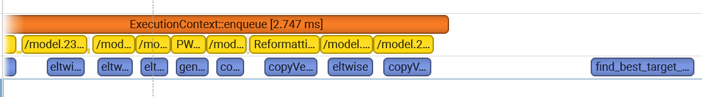
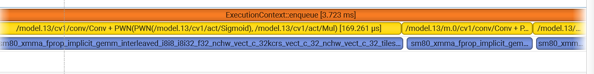

# 🚀 High-Performance Visual Servo System (TensorRT & CUDA)

[](https://en.cppreference.com/w/cpp/17)
[](https://developer.nvidia.com/cuda-toolkit)
[](https://developer.nvidia.com/tensorrt)
[]()
[](LICENSE)

> **An ultra-low latency (<5ms) computer vision pipeline featuring custom CUDA kernels, TensorRT INT8 quantization, and a closed-loop PID controller.**

---

## 📖 Introduction (项目简介)

This project implements a high-frequency **Visual Servo Control System** designed for real-time object tracking and actuation. 

Unlike traditional Python-based pipelines that suffer from CPU bottlenecks and memory copy overhead, this project leverages **Heterogeneous Computing**. By offloading preprocessing (Resize/Normalize/HWC2CHW) and postprocessing (NMS/Parallel Reduction) to custom **CUDA Kernels**, and utilizing **TensorRT INT8** inference, the system achieves physical hardware limits in terms of latency and throughput.

**Key Applications:**
* Industrial Robot Visual Servoing (High-speed sorting/grabbing)
* UAV/Drone Target Tracking
* Optical Feedback Control Systems

---

## ⚡ Performance Benchmark (性能对决)

The core optimization goal was to minimize **End-to-End Latency** (Photon-to-Action).

| Pipeline Stage | Baseline (OpenCV CPU) | **Optimized (CUDA + TensorRT)** | **Speedup** |
| :--- | :--- | :--- | :--- |
| **Preprocessing** | ~10.00 ms | **0.03 ms** | **~300x** 🚀 |
| **Inference** | ~15.00 ms (FP32) | **2.10 ms (INT8)** | **~7x** |
| **Postprocessing** | ~2.00 ms (CPU NMS) | **0.05 ms (GPU Reduction)** | **~40x** |
| **Total Latency** | **> 30 ms** | **< 5 ms** | **~6x** |

### 📊 Nsight Systems Profiling Evidence

**Before Optimization (CPU Bound):**
*Note the sparse GPU utilization and large gaps due to GIL and PCI-e transfer overhead.*


**After Optimization (Fully Saturated Pipeline):**
*GPU is fully utilized with tightly packed kernels. Preprocessing and Inference are fused in a single CUDA Stream.*


---

## 🏗️ System Architecture (系统架构)

The system adopts a **Producer-Consumer model**. The Python layer handles the high-level control logic (PID), while the C++ shared library handles the heavy lifting on the GPU.

```mermaid
graph TD
    subgraph "Host (CPU) - Control Plane"
        A[DXCam Sensor Input] -->|Raw Frame| B(Pinned Memory Buffer)
        G[Data Parsing] -->|Candidates| H{PID Controller}
        H -->|Tracking Signal| I[Actuator Interface]
    end

    subgraph "Device (GPU) - Compute Plane"
        B -->|HtoD Async Copy| C[CUDA Stream]
        subgraph "Custom Kernels"
            C --> D[Preprocess Kernel<br/>Bilinear Interpolation]
            D --> E[TensorRT Engine<br/>INT8 Inference]
            E --> F[Postprocess Kernel<br/>Parallel Reduction Top-K]
        end
        F -->|DtoH Async Copy| G
    end

    style D fill:#f96,stroke:#333,stroke-width:2px
    style F fill:#f96,stroke:#333,stroke-width:2px
    style E fill:#ff9,stroke:#333,stroke-width:4px

⚡ Performance Optimization (性能优化核心)
1. Custom CUDA Preprocessing (算子融合)
Instead of using standard cv2.resize and cv2.cvtColor, I implemented a fused CUDA kernel (preprocess.cu).

Operations Fused: Bilinear Interpolation + Normalization + HWC-to-CHW Transpose.

Result: Preprocessing latency reduced from 10ms (CPU) to 0.03ms (GPU).

2. Parallel Reduction Post-processing (并行规约)
Handling 8400+ anchor boxes on the CPU is slow.

Optimization: Implemented a Tree-Based Parallel Reduction algorithm (decode.cu) using Shared Memory.

Result: The Top-1 target is filtered directly on the GPU, minimizing Device-to-Host data transfer overhead.

3. Profiling Evidence (Nsight Systems)
Figure 1: Baseline (CPU-Bound). Note the large gaps between GPU activities due to CPU overhead.

Figure 2: Optimized (Fully Pipelined). GPU kernels are densely packed (99% utilization during active tracking).
