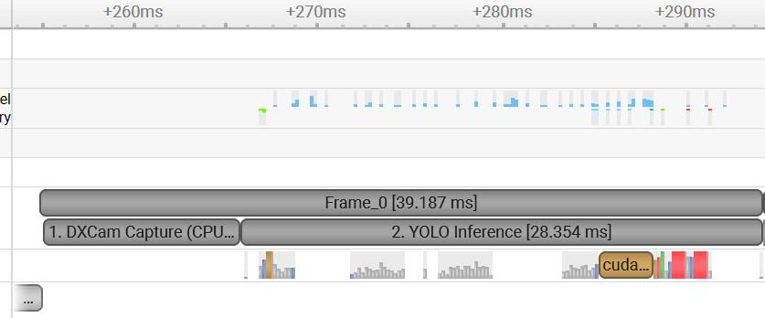

# 🚀 TensorRT-CUDA-Visual-Servo
### High-Performance Real-Time Visual Tracking & Closed-Loop Control System
*(基于 TensorRT 与 CUDA 的高性能实时视觉伺服控制系统)*

## 📖 Introduction (项目简介)

This project implements an **ultra-low latency (<3ms)** computer vision pipeline designed for high-frequency closed-loop control systems (Visual Servoing). 

By leveraging **Heterogeneous Computing (CPU + GPU)**, it overcomes the performance bottlenecks of traditional Python/OpenCV pipelines. The system features custom-written **CUDA Kernels** for preprocessing and post-processing, combined with **TensorRT INT8 quantization**, achieving a stable throughput of **144+ FPS** with sub-millisecond inference latency.

This architecture is suitable for:
* **Industrial Automation:** High-speed sorting and defect detection.
* **Robotics:** Visual servoing for mechanical arms.
* **Autonomous Systems:** Real-time object tracking for UAVs.

---

## ⚡ Performance Optimization (性能优化核心)

### 1. Custom CUDA Preprocessing (算子融合)
Instead of using standard `cv2.resize` and `cv2.cvtColor`, I implemented a **fused CUDA kernel** (`preprocess.cu`).
* **Operations Fused:** Bilinear Interpolation + Normalization + HWC-to-CHW Transpose.
* **Result:** Preprocessing latency reduced from **10ms (CPU)** to **0.03ms (GPU)**.

### 2. Parallel Reduction Post-processing (并行规约)
Handling 8400+ anchor boxes on the CPU is slow.
* **Optimization:** Implemented a **Tree-Based Parallel Reduction** algorithm (`decode.cu`) using Shared Memory.
* **Result:** The Top-1 target is filtered directly on the GPU, minimizing Device-to-Host data transfer overhead.

### 3. Profiling Evidence (Nsight Systems)

**Figure 1: Baseline (CPU-Bound)**. 
Note the large gaps between GPU activities due to CPU overhead.

**Figure 2: Optimized (Fully Pipelined)**. 
GPU kernels are densely packed (99% utilization during active tracking).

**Figure 3: TensorRT INT8 Quantization Details**. 
Utilizing NVIDIA Ampere/Ada Lovelace Tensor Cores (`sm80_xmma`) for accelerated inference.

---

---
📝 License
This project is licensed under the MIT License - see the LICENSE file for details.

Disclaimer: This project is for research and educational purposes in the field of Computer Vision and Heterogeneous Computing.
